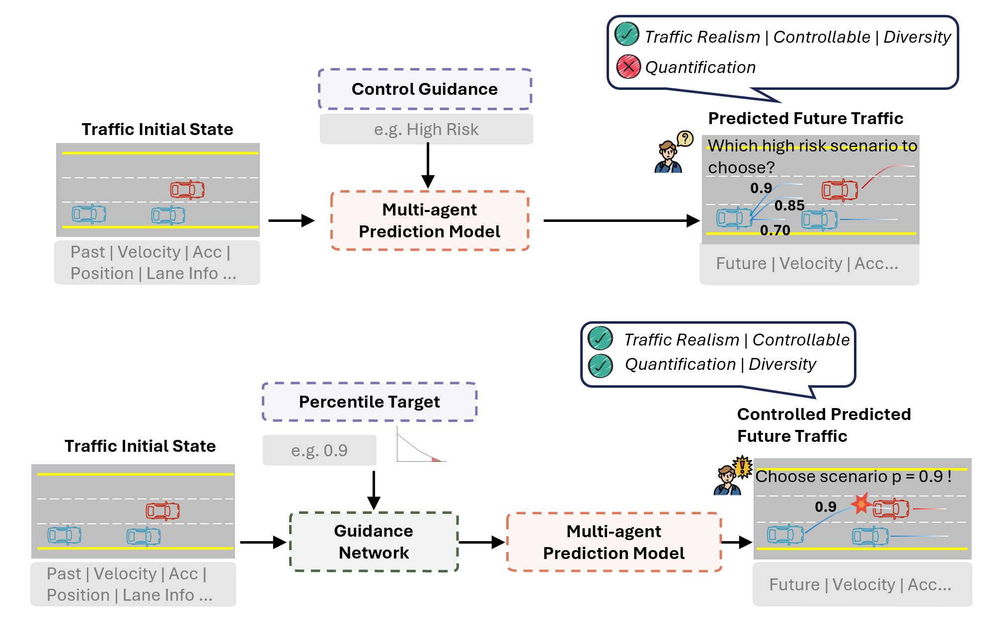
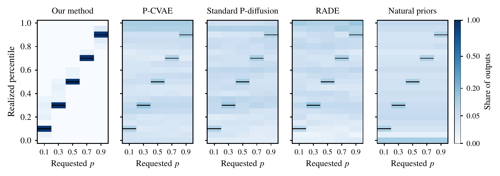

<div align="center">

<h1>How corner is a corner case?<br>Percentile control for highway scenario generation</h1>

<p>Jiaxi Liu, Hang Zhou, Hangyu Li, Yifan Wang, Keke Long, Chengyuan Ma, Bin Ran, Xiaopeng Li</p>

<p>Department of Civil and Environmental Engineering, University of Wisconsin–Madison</p>

<p>
  <a href="https://hhjj233.github.io/CornerPercentile/"></a>
  <a href="#citation"></a>
  <a href="https://levelxdata.com/highd-dataset/"></a>
  <a href="https://hhjj233.github.io/CornerPercentile/#planner-test"></a>
</p>
<p>
  <a href="LICENSE"></a>
  <a href="https://www.python.org/"></a>
  <a href="https://pytorch.org/"></a>
</p>

</div>

This is the official implementation of the paper "How corner is a corner case? Percentile control for highway scenario generation", submitted to *Transportation Research Part C: Emerging Technologies*. The [project page](https://hhjj233.github.io/CornerPercentile/) shows videos of the planner test.



*Top: existing interfaces take tokens, language prompts or constraints and leave adversity percentiles unquantified. Bottom: our view, where a corner case is indexed by a target adversity percentile p.*

The same one-second post-encroachment time (PET) can be routine in one traffic context and rare in another. We therefore index a generated corner case by its **risk percentile** *p* in the distribution of future risk conditioned on the observed history. A learned reference distribution maps each requested percentile to a physical risk target, a percentile-conditioned joint diffusion model with sampling-time risk guidance generates the futures of all vehicles, and a reference-based criterion checks whether the generated future lands at the requested percentile, including outcomes at the point masses of PET. On the 16 test recordings of highD, the released models realize 1,422 of 1,440 requests within 0.05 of the requested percentile (98.75%), with mean percentile error 0.00673 and PET-target error 0.00991 s.

The contribution of the paper is the request definition. The reference and the generator released here are one implementation of it, and any calibrated conditional distribution and any generator that can be steered toward a physical target can serve in their place.

## Installation
```bash
# Clone repo
git clone https://github.com/hhjj233/P-control-SG
cd P-control-SG

# Setup conda environment
conda create -y --name pcontrol python=3.12
conda activate pcontrol

# PyTorch >= 2.2. Generation runs on the CPU, as in the paper.
pip install torch --index-url https://download.pytorch.org/whl/cpu

# Install dependencies and the pcontrol package
pip install -r requirements.txt
pip install -e .
```
The paper's results were computed with Python 3.12.2, PyTorch 2.9.0, NumPy 2.4.6, SciPy 1.15.2 and pandas 2.2.3. With these versions, the released models reproduce the paper's generated futures exactly.

## Data
### Download
The experiments use the [highD dataset](https://levelxdata.com/highd-dataset/), which its provider makes freely available for non-commercial research on request. This repository contains no highD data, raw or processed.

### Structure
After downloading, place the recordings as follows:
```sh
P-control-SG               # root of this repository
├── highD
│   └── data               # 01_tracks.csv, 01_tracksMeta.csv, 01_recordingMeta.csv, ..., 60_*.csv
├── checkpoints            # released reference and generator
├── configs                # recording split and the configurations of the paper's training stages
└── pcontrol               # the code
```

### Preparation
Scenes are built from each recording as in the paper: a history of 13 states (0.96 s) of the ego and every same-direction vehicle within 120 m, a future of 175 states (6.96 s at 25 Hz), kept when every vehicle is observed over the whole future, and the minimum PET between the ego and its surrounding vehicles (capped at 4 s).
```bash
python pcontrol/tools/prepare_highd.py --raw-root highD/data --split test --out data/scenes
```
Arguments:
- `raw-root`: the folder with the highD CSV files.
- `split` / `recordings`: the recordings of a split of `configs/highd_split_v1.json` (`train`, `val`, `test`), or a list of recording ids.
- `out`: the output folder. Each recording gets a `complete_scenes.npz`, read by `pcontrol.api.load_scenes`.

The `test` split gives the paper's primary evaluation set (11,649 scenes from 16 recordings), identical to the scenes used in the paper, in about three minutes per recording. More details are in [docs/data.md](docs/data.md).

## Getting Started
### Pretrained models
`checkpoints/reference.pt` is the calibrated range-query reference (the history-conditioned PET distribution, 1 MB). `checkpoints/generator.pt` is the percentile-conditioned joint diffusion model with its normalizers and guidance settings (4 MB). Both are the models of the paper.

### Generate scenarios at requested percentiles
```bash
python pcontrol/tools/generate.py --scenes data/scenes --paper-histories --out outputs/generation
python pcontrol/tools/evaluate.py --rows outputs/generation/rows.jsonl
```
Arguments of `generate.py`:
- `scenes`: `complete_scenes.npz` files, or folders that contain them.
- `requests`: the requested risk percentiles in (0, 1). The default is the paper's 0.1, 0.3, 0.5, 0.7, 0.9. A request p asks for a future that is more critical than a share p of the natural futures of its history.
- `paper-histories` (optional): select 32 histories per vehicle-count group (3–5, 6–8, ≥9 vehicles) as in the paper. Without it, every scene is used, or the first `limit` scenes, or the scenes listed in `scene-ids`.
- `noise`: `paper` uses the paper's three initial noises per history (`draws` ≤ 3), and `random` uses seeded Gaussian noise (`seed`, `draws`).
- `out`: one record per request in `rows.jsonl` (realized PET, its percentile interval, physical target and errors, footprint overlap and road checks), and the generated futures in `futures/<scene_id>_z<draw>.npz`, one `(175, N, 4)` array (x, y, vx, vy; ego first) per request.

On the `test` split, the commands above reproduce the main result of the paper (Table 2), and every generated future equals the one of the paper:
```
             requests  Fine (%)    P-MAE  PET-MAE  BG (%) Ego (%) Road (%)
all              1440     98.75  0.00673  0.00991    0.00    0.00     5.76
p = 0.1           288     97.92  0.00850  0.01100    0.00    0.00     5.56
p = 0.3           288     98.61  0.00725  0.00345    0.00    0.00     5.56
p = 0.5           288     99.65  0.00528  0.00123    0.00    0.00     6.25
p = 0.7           288     99.65  0.00489  0.00156    0.00    0.00     5.56
p = 0.9           288     97.92  0.00773  0.03229    0.00    0.00     5.90
N3_5              480     97.08  0.00822  0.02270    0.00    0.00     6.25
N6_8              480     99.58  0.00571  0.00372    0.00    0.00     3.12
N9_plus           480     99.58  0.00625  0.00330    0.00    0.00     7.92
```
Fine is the share of requests realized within 0.05 of the requested percentile, P-MAE the mean percentile error, PET-MAE the mean error with respect to the physical target (s), BG and Ego the shares of futures with background–background or ego–SV footprint overlap, and Road the share with a strict road violation, mostly inherited from the observed initial scene. Generation takes about two seconds per request on a CPU, so the 1,440 requests of the test split take under an hour.

### Use the models in Python
```python
from pcontrol.api import load_reference, load_generator, load_scenes, random_noise

reference = load_reference('checkpoints/reference.pt')
generator = load_generator('checkpoints/generator.pt', reference)

scene = next(load_scenes('data/scenes/35/complete_scenes.npz'))
cdf = reference.condition_features(scene['features'])      # history-conditioned PET distribution
print(cdf.rank(1.0))                                          # percentile interval of a 1 s PET in this history

prepared = generator.prepare(scene['features'])
future, info = generator.sample(prepared, 0.9, random_noise(scene['num_agents'], seed=0))
print(info['canonical_target_PET_seconds'], info['pet_seconds'], info['estimated_rank'])
```

### Train your model
The released models were trained with the scripts in `pcontrol/research/` and the configurations in `configs/natural_percentile/`: scene construction, the reference and its calibration map, leave-recording-out percentile labels, and a sequence of fifteen generator training stages, each continuing from the weights of the previous one. [docs/training.md](docs/training.md) lists the stages in order with their scripts and configurations. The scripts are kept as they were run: each stage verifies the SHA-256 of its inputs and writes to the folders named in its configuration, so a new run needs its configurations pointed to your own data and outputs.

### Experiments of the paper
The scripts of the remaining experiments are also in `pcontrol/research/`: the P-path ablation, the P-CVAE, Standard P-diffusion and RADE baselines, the time-to-collision requests, the kinematic realism check, the bootstrap intervals and the test of an IDM and MOBIL planner on the generated scenarios. [docs/experiments.md](docs/experiments.md) maps the tables and main results of the paper to the scripts that produced them. The external priors (TrafficGen, CTG++, STRIVE) were run from their official implementations and are not included.



*Where the outputs land (Fig. 4 of the paper): for each requested percentile, the share of generated futures whose realized percentile falls in each band. Black lines mark the requests.*

## Code structure
```sh
pcontrol
├── api.py                    # load the released models, read scenes, generate
├── tools                     # prepare_highd.py, generate.py, evaluate.py
├── data                      # highD reading, scene construction, footprint PET
├── reference                 # temporal-relational reference, mixed CDF, calibration, frozen inverse
├── generation                # joint diffusion, percentile conditioning, risk guidance, road and background constraints
├── plugins                   # reference interface used during generation
├── publication_pipeline      # final evaluation adapters
├── time_attention_pipeline   # shared CDF arithmetic and generator data
└── research                  # the scripts of the paper's training stages and experiments, as run
```
See [docs/code_structure.md](docs/code_structure.md) for where each part of the method lives.

## Citation
If you use this code, please cite:
```bibtex
@article{liu2026corner,
  title   = {How corner is a corner case? Percentile control for highway scenario generation},
  author  = {Liu, Jiaxi and Zhou, Hang and Li, Hangyu and Wang, Yifan and
             Long, Keke and Ma, Chengyuan and Ran, Bin and Li, Xiaopeng},
  journal = {Transportation Research Part C: Emerging Technologies},
  note    = {Under review},
  year    = {2026}
}
```

## Acknowledgement
This material is based upon work supported by the U.S. National Science Foundation (NSF) under the NSF-DST Cyber-Physical Systems program, Award No. [2343167](https://cps-vo.org/node/98755).

The experiments use the [highD dataset](https://levelxdata.com/highd-dataset/) (Krajewski et al., 2018). The planner-test videos of the project page are rendered with [MetaDrive](https://github.com/metadriverse/metadrive).

## License
This code is released under the [MIT License](LICENSE).
